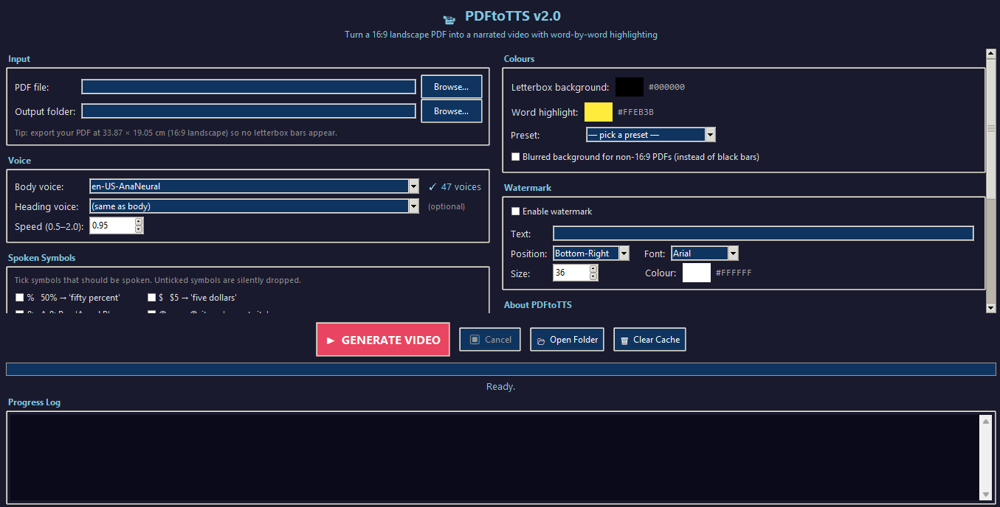

# 📹 PDFtoTTS

**Turn a 16:9 landscape PDF into a narrated MP4 with word-by-word highlighting — no editing software, no manual timing.**

Point it at a PDF, pick a voice, click Generate. PDFtoTTS reads the text, synthesises speech with Microsoft Edge's free neural voices, maps every spoken word back to its exact position on the page, and renders a video where a coloured highlight sweeps across the real page design in sync with the narration.

> **v2.0** — Major update: eliminates highlight drift on long videos, adds chapter markers, karaoke mode, blurred background, sentence-aware chunking, and dual-voice headings.



---

## ✨ Features

| Feature | Details |
|---|---|
| **Neural TTS** | Microsoft Edge voices — free, no API key, 20+ English accents |
| **Word-level highlight** | Marker positioned using the PDF's own text coordinates |
| **Drift-free sync** | Offsets built from real measured audio durations, not event estimates — stays locked even on 2-hour videos |
| **Page design preserved** | Tables, headings, colours, borders, images — all intact |
| **Auto page transitions** | Synced to narration; flips after the last complete sentence on each page |
| **Chapter markers** | Embedded in the MP4 at every heading — navigate with VLC, mpv, or any chapter-aware player |
| **Karaoke mode** | Current line dims to context, active word blazes full colour |
| **Blurred background** | Non-16:9 PDFs get a blurred zoomed backdrop instead of black bars |
| **Dual-voice headings** | Assign a separate voice to heading text for emphasis |
| **Watermark** | Configurable text, position, font, size, colour |
| **Preview mode** | Render first page only before committing to the full run |
| **Smart cache** | Completed TTS chunks are cached — a second run is nearly instant |
| **Colour presets** | Six built-in highlight schemes, fully customisable |
| **Spoken symbols** | Opt-in per symbol: `%` `$` `&` `@` `+` `=` |
| **No command line** | Two-column GUI, settings auto-saved between runs |

---

## 🖼️ How it looks

```
┌─────────────────────────────────────────────────────────┐
│  PDF page rendered at 1920×1080                         │
│                                                         │
│  Chapter 3: Neural Networks                             │
│                                                         │
│  A neural network is a series of algorithms that        │
│  [━━━━━━━━━━━] ▓▓▓▓▓▓▓▓▓ ░░░░░░░░░░░░░░░░░░░░░░░       │
│   current line   active word                            │
│  attempts to recognise relationships in a set of        │
│  data through a process that mimics the way the…        │
└─────────────────────────────────────────────────────────┘
```

- **Active word** — full highlight colour (e.g. yellow `#FFEB3B`)
- **Current line** (karaoke mode) — same colour at 30% opacity for context
- **Heading afterglow** — highlight lingers briefly after a heading is read

---

## 📋 Requirements

| Requirement | Install |
|---|---|
| Python 3.8+ | [python.org](https://www.python.org/downloads/) |
| FFmpeg (on PATH) | [ffmpeg.org](https://ffmpeg.org/download.html) |
| edge-tts | `pip install edge-tts` |
| PyMuPDF | `pip install pymupdf` |

**Verify FFmpeg is on PATH:**
```bash
ffmpeg -version
```

---

## 🚀 Quick start

```bash
# 1. Clone
git clone https://github.com/israk404/pdftotts.git
cd pdftotts

# 2. Install Python dependencies
pip install edge-tts pymupdf

# 3. Run
python pdftotts.py
```

The GUI opens. Select your PDF, pick a voice, and hit **▶ GENERATE VIDEO**.

---

## 🖥️ GUI overview

```
┌─────────────────────┬────────────────────────┐
│  Input              │  Colours               │
│  Voice              │  Watermark             │
│  Spoken Symbols     │  About                 │
│  Playback           │                        │
├─────────────────────┴────────────────────────┤
│  ▶ GENERATE  ⏹ Cancel  📂 Open Folder  🗑 Clear │
│  ████████████████░░░░░░ progress bar         │
│  Progress log…                               │
└──────────────────────────────────────────────┘
```

### Left panel

**Input**
- PDF file path + output folder (Browse buttons)

**Voice**
- *Body voice* — voice for all regular text (20+ EN accents)
- *Heading voice* — optional separate voice for headings
- *Speed* — 0.5× to 2.0×

**Spoken Symbols**
- Toggle which symbols the TTS engine reads aloud: `%` `$` `&` `@` `+` `=`
- Unticked symbols are silently dropped before synthesis

**Playback**
- *Page transition delay* — ms to wait before flipping (default 200)
- *Heading afterglow* — ms the highlight lingers on a heading (default 400)
- *End tail* — silence padding at the end of the video (default 1500)
- *Timing offset* — global nudge in ms if you want to fine-tune (usually 0 — drift is fixed automatically)
- *Preview mode* — render first page only
- *Karaoke mode* — dim the current line, blaze the active word

### Right panel

**Colours**
- Letterbox background colour
- Word highlight colour
- Six built-in presets (Marker yellow, Warm amber, Neon cyan, …)
- *Blurred background* — for non-16:9 PDFs: zoom+blur the page behind itself instead of black bars

**Watermark**
- Enable/disable, text, position (6 options), font, size, colour

---

## 📐 PDF tips

For the cleanest result, export your PDF at **33.87 × 19.05 cm** (exact 16:9 landscape). This fills the 1920×1080 canvas with no bars.

If your PDF is a different aspect ratio:
- Default: **black bars** (letterbox)
- With *Blurred background* on: the page is zoomed and blurred to fill the bars

---

## 🔄 How it works (pipeline)

```
PDF
 │
 ▼
1. Extract pages → PNG images + word bounding boxes (PyMuPDF)
 │
 ▼
2. Chunk text → sentence-boundary-aware segments ≤ 3500 chars
 │
 ▼
3. TTS synthesis → per-chunk MP3 + WordBoundary events (edge-tts)
   └─ Cached: reruns skip completed chunks
 │
 ▼
4. Measure real MP3 durations (ffprobe)
   └─ Scale event timings proportionally into real audio window
   └─ Accumulate offsets from real durations → no cumulative drift
 │
 ▼
5. Combine MP3 chunks → narration.wav (FFmpeg concat)
 │
 ▼
6. Align WordBoundary events → PDF word bboxes
   └─ Lookahead of 10 words, slip-resistant, ligature-aware
 │
 ▼
7. Build chapter metadata (.ffmetadata) from heading positions
 │
 ▼
8. Generate ASS subtitle overlay (highlights + watermark)
   └─ Optional karaoke line-context layer
 │
 ▼
9. Render final MP4 (FFmpeg: page PNGs + audio + ASS + chapters)
```

---

## ⚙️ Settings file

Settings are auto-saved to `~/.pdftotts_config.json` between runs. Voice, speed, colours, watermark, and all toggles persist.

---

## 🗂️ Project cache

Each PDF gets a `<name>_project/` folder next to the output:

```
my_slides_project/
├── project.json          ← manifest (chunk state, real durations)
├── audio/
│   ├── chunk_0000.mp3
│   ├── chunk_0001.mp3
│   └── …
├── timestamps/
│   ├── chunk_0000_words.json
│   └── …
├── page_0000.png
├── page_0001.png
├── narration.wav
├── highlights.ass
└── chapters.ffmeta       ← chapter markers (if headings found)
```

- On rerun, completed chunks are skipped (instant second pass)
- Click **🗑 Clear Cache** in the GUI to start fresh

---

## 🎵 Chapter navigation

If the PDF contains headings, PDFtoTTS embeds chapter markers in the MP4. You can then:

- **VLC** → Playback → Chapters
- **mpv** → `[` / `]` keys, or the chapter menu
- **Web** (HTML5 `<video>`) — chapters appear in the seek bar in supported browsers

---

## 🔧 Troubleshooting

| Symptom | Fix |
|---|---|
| `FFmpeg not found` | Add FFmpeg to your system PATH and restart |
| `No extractable text` | PDF is scanned — run OCR first (e.g. `ocrmypdf input.pdf output.pdf`) |
| Highlight slightly off | Use the *Timing offset* slider (negative = earlier, positive = later). Usually not needed — drift is corrected automatically. |
| Voice sounds cut off at page seams | Enable sentence-boundary chunking (on by default in v2.0) |
| Non-16:9 black bars | Enable *Blurred background* in the Colours panel |
| `TTS stream error` | Check internet connection; the tool retries up to 6× with backoff |
| Output file already exists | A `_v2`, `_v3` … suffix is added automatically |

---

## 📦 Output

- **`<pdf-name>.mp4`** — 1920×1080, H.264 + AAC 192k, chapter markers embedded, `+faststart` for web streaming
- **`<pdf-name>_preview.mp4`** — first page only (Preview mode)

---

## 🗒️ Changelog

### v2.0
- **FIX (critical):** Highlight drift eliminated — offsets now built from real per-chunk MP3 durations measured by ffprobe. Highlights stay locked to the voice even on 2-hour videos.
- **FIX:** Alignment lookahead widened from 4 → 10 words; mismatches no longer cascade.
- **FIX:** Alignment skips an event rather than mis-assigning it when no match is found.
- **FIX:** TTS chunks now split on sentence boundaries, preventing mid-sentence seam artifacts.
- **FIX:** Cache validation checks minimum file size, catching truncated downloads.
- **FIX:** Page transitions fire after the last complete sentence, not just the last word.
- **FIX:** `os.startfile` replaced with cross-platform `subprocess` call (macOS/Linux support).
- **NEW:** Chapter markers (`.ffmetadata`) embedded in the MP4 at each heading.
- **NEW:** Blurred background mode for non-16:9 PDFs.
- **NEW:** Karaoke line-context mode.
- **NEW:** Dual-voice heading support.
- **NEW:** Ligature normalization in alignment (`fi` → `fi`, `fl` → `fl`).
- **NEW:** Verification summary in the log after alignment (drift check, first/last word timestamps).
- **NEW:** Per-chunk real duration cached in manifest — reruns skip re-measuring.

### v1.0
- Initial release

---

## 📄 License

MIT — do whatever you want with it.

---

<p align="center">
  Made by <a href="https://github.com/israk404">israk404</a> •
  <a href="https://github.com/israk404/pdftotts">github.com/israk404/pdftotts</a>
</p>
